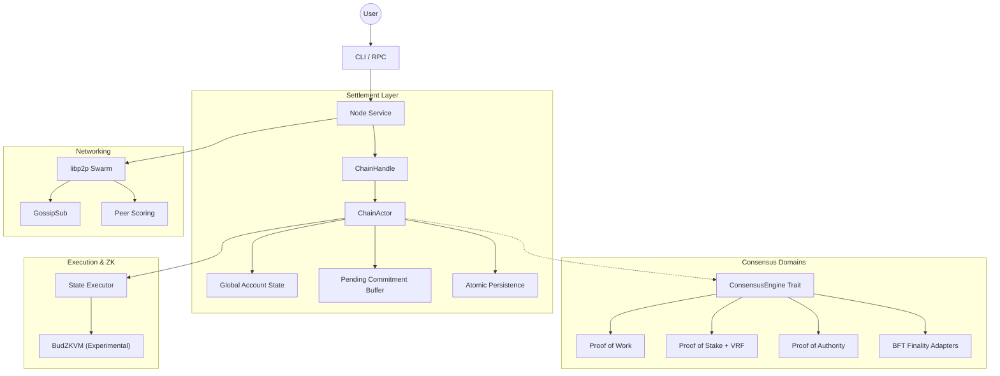

# ⚡ Budlum Core

> **A controlled public-devnet candidate for Layer-1 blockchain research: modular, deterministic, and multi-consensus native.**

[](https://github.com/rade/budlum-core)
[](https://github.com/rade/budlum-core)
[](https://opensource.org/licenses/MIT)
[](https://www.rust-lang.org/)

---

> [!CAUTION]
> **Controlled Public Devnet Candidate (v0.1-devnet-candidate)**
>
> Budlum Core is suitable for controlled public devnet experiments with clear risk disclaimers. It is **NOT** audited mainnet software, has not completed professional security review, and should **NOT** be used for financial transactions or production applications carrying real value.

---

Budlum Core is a Rust-based Layer-1 blockchain framework designed for engineers and protocol researchers who want to explore modular consensus, deterministic state settlement, and cross-domain interoperability.

If this project helps your research, please support it:
⭐ **Star the repo** | 🍴 **Fork it** | 🧠 **Open a discussion**

---

## 🏗️ Architectural Vision

Most blockchain frameworks are optimized for a single consensus worldview. Budlum is designed as a **Universal Settlement Layer** to research how heterogeneous networks (PoW, PoS, BFT) can achieve deterministic state convergence without centralized intermediaries.

### Why Budlum?
- 🔁 **Heterogeneous Settlement**: Infrastructure for running parallel consensus domains (PoW, PoS, BFT) on a unified settlement layer.
- 🌉 **Verified Trustless Interop**: Experimental bridge flow where lock, mint, burn, and unlock are tied to committed domain events and Merkle proofs.
- 🧠 **Deterministic Execution**: Research into replay-safe state transitions and consistent global headers.
- 🧩 **Modular Core**: Decoupled consensus, networking, and execution layers for rapid prototyping.
- 🌐 **P2P Native**: Built on `libp2p` with GossipSub and headers-first synchronization.
- 🛠️ **Developer First**: Fully documented JSON-RPC API and 100% test-verified core paths.

---

## 🏗️ Architecture Overview



---

## 🧩 Devnet Candidate Features (v0.1)

### 🌍 Multi-Consensus Settlement (Model B)
An implementation of a **Byzantine-Hardened Settlement Layer** designed for network chaos:
- **Verified-Only Commitments**: Production and public RPC paths reject raw domain commitments; settlement updates must arrive as `VerifiedDomainCommitment` with a matching finality proof hash.
- **Adapter Hardening**: PoW requires confirmation depth plus non-zero work hint; PoS binds finality certificate, validator snapshot, commitment, and registered validator-set hash.
- **Parent-Linked Domain History**: Production settlement rejects domain commitments whose `parent_domain_block_hash` does not link to the last committed domain block.
- **Strict Nonce Invariant**: Immediately applicable commitments with stale or equal nonce updates are rejected before durable insertion.
- **Byzantine Resilience**: Global state convergence verified via an 18-test "Chaos Matrix" under simulated partitions and delays.
- **Equivocation Immunity**: Protocol-level detection and global freezing of domains that produce conflicting block hashes at the same height; exact duplicate commitments remain idempotent.
- **Atomic Settlement Persistence**: Commitment insertions and domain height/hash updates are persisted in one storage batch.
- **Domain Operator Bonds**: Domain registration requires a non-zero operator identity and a minimum bond, creating an economic hook for frozen domains.
- **Idempotent Processing**: Identical commitments produce the same state root regardless of arrival order.

### 🌉 Verified Cross-Domain Bridge
- **Bridge-Enabled Domains Only**: Asset registration and lock operations require active, registered, bridge-enabled domains.
- **Safe Lock Constraints**: Source and target domains must differ, transfer amount must be non-zero, and expiry must be after the source event height.
- **Raw Burn/Unlock Disabled**: Direct bridge burn and unlock calls are rejected as settlement authority.
- **Proof-Based Return Path**: Funds return only after a target-domain `BridgeBurned` event is committed and verified through its event Merkle proof.

### 🛡️ Post-Quantum Readiness (Experimental)
- Research into Dilithium-based checkpoint attestations.
- `FinalityCert` logic requiring verified `QC_BLOB` metadata.
- PQ-fault-proof infrastructure for invalid attestation detection.

### ⚙️ BudZKVM Execution (In-Progress)
- Research into STARK-proven contract execution inside the L1 path.
- Gas-limited deterministic VM execution (Prototype).
- Atomic rejection of invalid bytecode or failed proofs.

### 🌐 Networking & Resilience
- **libp2p Integration**: Robust P2P transport with peer reputation.
- **Automatic Sync Start**: Handshake height gaps trigger headers-first sync, and `bud_syncing` reports real sync state.
- **Slashing Evidence Gossip**: PoS double-sign evidence is gossiped as a network message and included by later producers.
- **Operational Resilience**: Anti-spam mempool, fee-based ordering, and database integrity audits.
- **Deterministic Restarts**: State recovery from persistent Sled-backed storage.

### 💰 Devnet Validator Economics
- Block rewards are distributed through the execution layer.
- Verified slashing evidence deducts validator stake and marks validators as slashed.
- Structured `BudlumError` exists and critical execution paths use checked APIs, while some compatibility wrappers still expose legacy string errors.
- Logging in consensus, network, block, and blockchain paths uses `tracing` instead of raw stdout prints.

---

## 🧪 Verification & Test Coverage

Budlum Core is built with a "Test-First" engineering mindset. The architecture is validated against extreme edge cases and adversarial scenarios.

- **Total Tests**: `263` (All passing ✅)
- **Byzantine Chaos Matrix**: 18 specific scenarios covering network partitions, packet duplication, out-of-order delivery, and domain equivocation.
- **Distributed Devnet Simulation**: Verified gossip convergence across a 5-node `libp2p` mesh with isolated storage.
- **Persistence Recovery**: State and pending buffers are recovered after simulated node crashes during pending commitment cycles.
- **Shared-State Safety**: Deterministic double-spend protection across heterogeneous consensus domains.
- **Verified Bridge Lifecycle**: Lock, mint, burn, and unlock are tested through committed events and Merkle proofs.

To run the full suite:
```bash
nix develop --command cargo test
```

---

## ⚡ Quick Start (Local / Controlled Public Devnet)

### Requirements
- Rust `1.70+`
- `protoc` (Protocol Buffers)

### Build
```bash
git clone https://github.com/rade/budlum-core.git
cd budlum-core
cargo build --release
```

### Run a Devnet Node
Use the following flags to test different consensus adapters:

```bash
# Proof of Work
./target/release/budlum-core --consensus pow --difficulty 3 --port 4001

# Proof of Stake
./target/release/budlum-core --consensus pos --min-stake 5000 --db-path ./data/pos_node
```

### 🛠️ Developer Experience (JSON-RPC)

Interact with the node using standard JSON-RPC 2.0. Every core action is exposed via the `bud_` namespace.

Settlement-changing RPC calls are intentionally proof-gated:
- `bud_submitDomainCommitment` is disabled; use `bud_submitVerifiedDomainCommitment`.
- `bud_burnBridgeTransfer` and `bud_unlockBridgeTransfer` are disabled raw paths.
- Use `bud_burnBridgeTransferWithEvent` and `bud_unlockBridgeTransferVerified` for the verified bridge return flow.

```bash
# Get current block height
curl -X POST -H "Content-Type: application/json" --data '{"jsonrpc":"2.0","method":"bud_blockNumber","params":[],"id":1}' http://localhost:8545

# Get balance of a researcher address
curl -X POST -H "Content-Type: application/json" --data '{"jsonrpc":"2.0","method":"bud_getBalance","params":["0x..."],"id":1}' http://localhost:8545
```

See the full [**Protocol Specification**](SPECIFICATION.md) for a detailed API reference.

---

## 🗺️ Research Roadmap

- [x] **Devnet Economic Hardening**: Validator reward distribution and slashing execution.
- [x] **Settlement Atomicity**: Atomic commitment + domain height/hash persistence.
- [x] **Verified Settlement Hardening**: Proof-gated domain commitments, parent-link checks, strict nonce rejection, and validator-set anchoring.
- [x] **Verified Bridge Return Path**: Bridge unlock requires a committed target-domain burn event proof.
- [x] **Sync Hardening**: Handshake-triggered headers-first sync and real sync status reporting.
- [ ] **ZKVM Optimizations**: Improving STARK proof generation performance.
- [ ] **Formal Verification**: Researching TLA+ models for settlement convergence.
- [ ] **Mainnet Operations**: RPC rate limiting/auth, Docker/systemd packaging, health checks, and production runbooks.
- [ ] **Security Testing**: Fuzzing, expanded property tests, clippy cleanup, and external audit preparation.
- [ ] **Privacy Layer**: Exploring Monero-style and Zcash-style privacy primitives.
- [ ] **AI Execution Layer**: Investigating AI-assisted protocol automation and risk scoring.

---

## 🤝 Join the Research

Budlum is built for protocol researchers and developers who like looking under the hood. We welcome technical reviews, protocol design discussions, and security feedback.

### How to Contribute:
1. ⭐ **Star the Repository**: It helps other researchers find our work.
2. 🍴 **Fork & Experiment**: Try building a custom `ConsensusKind`!
3. 🧠 **Open a Discussion**: Have an idea for the Privacy Layer or AI Execution?
4. 🐛 **Report Bugs**: Use GitHub Issues for any technical anomalies.

Read [`CONTRIBUTING.md`](CONTRIBUTING.md) before participating. For security-sensitive reports, please use [`SECURITY.md`](SECURITY.md).

---

## 📄 License

MIT License. Copyright (c) 2026 The Budlum Developers.
