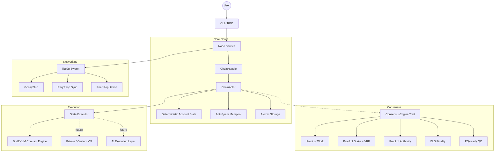

# ⚡ Budlum Core

> Build your own Layer-1 blockchain: modular, deterministic, privacy-ready, and ZKVM-native.

Budlum Core is a Rust-based Layer-1 blockchain framework for engineers, protocol researchers, and builders who want a real chain core they can inspect, modify, and extend.

If this project helps your research or experiments, please support it:

⭐ **Star the repo** to help more builders discover Budlum  
🍴 **Fork it** to experiment with your own consensus, VM, privacy, or network design  
🧠 **Open issues and discussions** if you want to shape the roadmap

---

## 🚀 Why Budlum?

Most blockchain frameworks are rigid, hard to reason about, or optimized for one fixed worldview.

Budlum is different:

- 🔁 **Swap consensus engines**: PoW, PoS, PoA, finality, and future hybrid modes
- 🧠 **Deterministic execution**: replay-safe state transitions and reorg recovery
- 🧩 **Modular architecture**: consensus, networking, storage, state, mempool, and execution are replaceable
- 🔒 **Security-first design**: hardened against spam, invalid states, malformed payloads, and unsafe replays
- 🌐 **High-performance networking**: libp2p, GossipSub, request/response sync, and peer reputation
- 🧪 **Research-friendly**: ideal for L1 experiments, custom chains, privacy systems, and execution-layer design
- 🕶️ **Privacy roadmap**: future privacy layer inspired by Monero-style privacy and Zcash-style zero-knowledge systems
- 🤖 **AI execution roadmap**: future AI-assisted execution layer for smarter protocol automation and validation flows

---

## 🏗️ Architecture Overview

Budlum is structured as loosely coupled modules connected through Rust traits and explicit state boundaries.



### Core Modules

| Module | Path | Purpose |
| :--- | :--- | :--- |
| Core types | `src/core/` | Blocks, transactions, accounts, addresses, chain config, governance |
| Chain | `src/chain/` | Blockchain state, `ChainActor`, snapshots, finality wiring |
| Consensus | `src/consensus/` | PoW, PoS, PoA, BLS finality, QC, slashing |
| Execution | `src/execution/` | Deterministic state transitions and BudZKVM contract execution |
| Networking | `src/network/` | libp2p node, protocol messages, sync codec, peer scoring |
| Mempool | `src/mempool/` | Fee ordering, nonce queues, anti-spam checks |
| Storage | `src/storage/` | sled-backed persistence, schema versioning, integrity checks |
| RPC | `src/rpc/` | JSON-RPC server and `bud_` methods |
| Docs | `docs/tr/book/`, `docs/en/book/` | Technical book covering architecture, consensus, storage, networking, and RPC |

---

## ⚡ Quick Start

### Requirements

- Rust `1.70+`
- `protoc`

### Build

```bash
git clone https://github.com/rade/budlum-core.git
cd budlum-core
cargo build --release
```

### Run a Node

#### ⛏️ Proof of Work

```bash
./target/release/budlum-core --consensus pow --difficulty 3 --port 4001
```

#### 🧠 Proof of Stake

```bash
./target/release/budlum-core --consensus pos --min-stake 5000 --db-path ./data/pos_node
```

#### 🏛️ Proof of Authority

```bash
./target/release/budlum-core --consensus poa --config config/devnet.toml
```

#### 🔗 Join a Network

```bash
./target/release/budlum-core --bootstrap /ip4/127.0.0.1/tcp/4001/p2p/12D3K...
```

#### ⚙️ Use a Network Config

```bash
./target/release/budlum-core --config config/devnet.toml
./target/release/budlum-core --config config/testnet.toml
```

Mainnet startup requires a real bootnode. Configure `[bootnodes].addresses` in `config/mainnet.toml` or pass `--bootstrap`.

---

## 🧩 Core Features

### 🔗 Pluggable Consensus

- PoW with SHA3 Hashcash
- PoS with VRF-based proposer selection
- PoA with validator rotation
- BLS finality layer
- Slashing checks for unsafe validator behavior
- PQ-ready QC / Dilithium attestation path

### ⚙️ Deterministic Execution

- Replay-safe state transitions
- Slot-based timestamps
- Fixed-point economic calculations
- Deterministic restart and reorg recovery
- Atomic block application
- Canonical state root tracking

### 🧠 BudZKVM Execution

- Contract execution inside the L1 path
- `TransactionType::ContractCall` support
- Gas-limited deterministic VM execution
- STARK proof generation and verification
- Invalid bytecode, failed proof, or VM failure rejects the transaction atomically

### 🌐 Networking

- libp2p transport
- GossipSub block and transaction broadcast
- Request/response sync protocol
- Headers-first synchronization
- Snapshot-based fast sync path
- Peer reputation and protocol-level DoS protection
- Chain ID and protocol-version isolation

### 🛡️ Production Hardening

- Anti-spam mempool
- Fee-based transaction ordering
- Replace-by-fee support
- Sequential nonce queues
- Database integrity checks with `--check-db`
- Index repair path with `--repair-db`
- Atomic persistence
- Snapshot export helpers
- Reorg-safe canonical metadata
- Payload size and signature validation

---

## 🕶️ Privacy & Private Execution Roadmap

Budlum is designed to grow toward privacy-native Layer-1 experimentation.

Planned research directions:

- **Privacy layer** inspired by Monero-style sender/receiver privacy and Zcash-style zero-knowledge proofs
- **Private transaction types** for shielded transfers and selective disclosure
- **Custom private VM** for confidential execution workflows
- **Proof-carrying execution** where private computation can be verified without exposing internal state
- **Privacy-aware mempool rules** to reduce metadata leakage
- **Auditable privacy primitives** with explicit cryptographic boundaries

The goal is not to clone Monero or Zcash. The goal is to make Budlum a clean Rust playground for privacy-preserving L1 design.

---

## 🤖 AI Execution Layer Roadmap

Budlum also leaves room for future AI-assisted protocol infrastructure.

Possible directions:

- AI-assisted transaction simulation and risk scoring
- Intelligent mempool filtering under spam conditions
- Automated state anomaly detection
- AI-guided validator operations and monitoring
- Protocol research agents for testing consensus and reorg scenarios
- Custom backend services running alongside the node for analysis, orchestration, and developer tooling

This layer is planned as an optional extension. Core consensus and execution must remain deterministic, auditable, and reproducible.

---

## 🔧 CLI Reference

Usage:

```bash
cargo run -- [OPTIONS]
```

| Flag | Description | Default |
| :--- | :--- | :--- |
| `--consensus <TYPE>` | `pow`, `pos`, `poa` | `pow` |
| `--network <NAME>` | `mainnet`, `testnet`, `devnet` | `devnet` |
| `--config <PATH>` | TOML config file | `None` |
| `--rpc-host <ADDR>` | JSON-RPC listen address | `127.0.0.1` |
| `--rpc-port <PORT>` | JSON-RPC listen port | `8545` |
| `--port <PORT>` | P2P listen port | Network default |
| `--db-path <PATH>` | Database directory | `./data/budlum.db` |
| `--difficulty <N>` | PoW mining difficulty | `2` |
| `--min-stake <AMT>` | PoS minimum stake | `1000` |
| `--validator-address` | Address to mine/validate for | `None` |
| `--bootstrap <ADDR>` | Peer multiaddr to join | `None` |
| `--check-db` | Run database integrity audit | `false` |
| `--repair-db` | Rebuild indexes from raw block data | `false` |

---

## 📚 Documentation

Full technical documentation lives in:

👉 Turkish: [`docs/tr/book/README.md`](docs/tr/book/README.md)

👉 English: [`docs/en/book/README.md`](docs/en/book/README.md)

Includes:

- Architecture deep dive
- Core block and transaction model
- Consensus design
- Cryptography and signatures
- Networking protocols
- Storage and snapshots
- JSON-RPC API
- Chaos engineering notes
- Benchmark results

---

## 🛠️ Development

### Run Tests

```bash
cargo test
```

With Nix:

```bash
nix develop --command cargo test
```

### Format & Lint

```bash
cargo fmt
cargo clippy
```

---

## 🧠 Use Cases

- Build custom Layer-1 chains
- Experiment with consensus algorithms
- Research deterministic execution
- Prototype ZK-native systems
- Explore privacy-preserving chain design
- Develop custom private VM concepts
- Build chain-specific backend services
- Study real-world blockchain architecture in Rust

---

## 🗺️ Roadmap

- [ ] ZKVM optimizations
- [ ] Parallel execution engine
- [ ] Multi-chain interoperability
- [ ] Advanced governance modules
- [ ] Privacy layer for shielded transactions
- [ ] Private/custom VM execution path
- [ ] AI-assisted execution layer
- [ ] Operator backend and analytics services
- [ ] Public devnet and validator onboarding

---

## 🤝 Contributing

Budlum is early, experimental, and built for people who like looking under the hood.

Ways to help:

- ⭐ Star the repo
- 🍴 Fork and build your own chain variant
- 🧪 Run tests and report issues
- 📚 Improve docs
- 🧠 Open protocol design discussions
- 🔐 Review privacy, consensus, and VM ideas

Read [`CONTRIBUTING.md`](CONTRIBUTING.md) before opening a pull request.

For security-sensitive reports, use [`SECURITY.md`](SECURITY.md) instead of opening a public issue.

Pull requests are welcome.

---

## 📄 License

MIT License. Copyright (c) 2026 The Budlum Developers.
