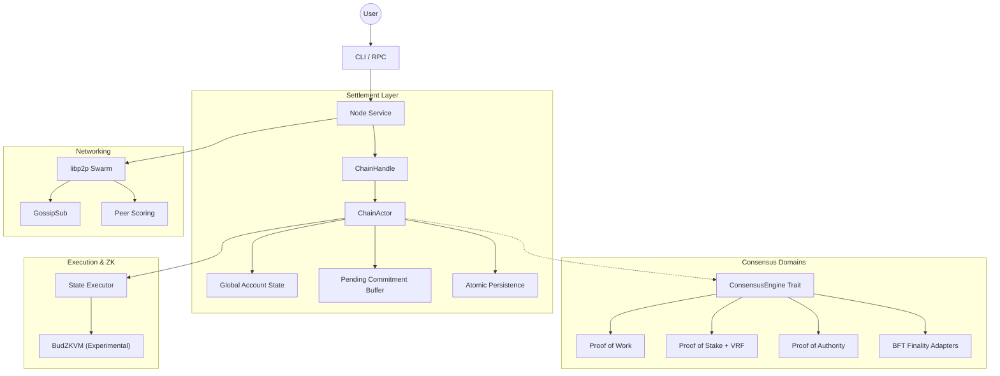

# ⚡ Budlum Core

> Build your own Layer-1 blockchain: modular, deterministic, privacy-ready, and ZKVM-native.

Budlum Core is a Rust-based Layer-1 blockchain framework for engineers, protocol researchers, and builders who want a real chain core they can inspect, modify, and extend.

---

> [!CAUTION]
> ### Experimental Research Prototype (v0.1-settlement-prototype)
> Budlum Core is currently in an early research and development phase. The codebase is provided for architectural review, protocol experimentation, and educational purposes. It is **NOT** production-ready, has not been audited, and should **NOT** be used for any financial transactions or production-grade applications.
> 
> For more technical details and active research, please check the [`feat/mutlic`](https://github.com/rade/budlum-core/tree/feat/mutlic) branch.

---


If this project helps your research, please support it:
⭐ **Star the repo** | 🍴 **Fork it** | 🧠 **Open a discussion**

---

## 🏗️ Architectural Vision

Most blockchain frameworks are optimized for a single consensus worldview. Budlum is designed as a **Universal Settlement Layer** to research how heterogeneous networks (PoW, PoS, BFT) can achieve deterministic state convergence without centralized intermediaries.

- 🔁 **Multi-Consensus Research**: Infrastructure for running parallel consensus domains on a unified settlement layer.
- 🌉 **Cross-Domain Interoperability**: Experimental cryptographic bridge for asset movement between isolated domains.
- 🧠 **Deterministic Execution**: Research into replay-safe state transitions and consistent global headers.
- 🧩 **Modular Core**: Decoupled consensus, networking, and execution layers for rapid prototyping.
- 🌐 **Peer-to-Peer Foundation**: Built on `libp2p` with GossipSub and custom request/response synchronization.

---

## 🏗️ Architecture Overview



---

## 🧩 Research Prototype Features (v0.1)

### 🌍 Multi-Consensus Settlement (Model B)
An implementation of a **Byzantine-Hardened Settlement Layer** designed for network chaos:
- **Registry-First Approach**: Validly structured domain commitments are archived for deterministic replay and auditability, while canonical state application is gated by verification, ordering, and conflict checks.
- **Byzantine Resilience**: Global state convergence verified via an 18-test "Chaos Matrix" under simulated partitions and delays.
- **Equivocation Immunity**: Protocol-level detection and global freezing of domains that produce conflicting commitments.
- **Idempotent Processing**: Identical commitments produce the same state root regardless of arrival order.

### 🛡️ Post-Quantum Readiness (Experimental)
- Research into Dilithium-based checkpoint attestations.
- `FinalityCert` logic requiring verified `QC_BLOB` metadata.
- PQ-fault-proof infrastructure for invalid attestation detection.

### ⚙️ BudZKVM Execution (In-Progress)
- Research into STARK-proven contract execution inside the L1 path.
- Gas-limited deterministic VM execution (Prototype).
- Atomic rejection of invalid bytecode or failed proofs.

### 🌐 Networking & Resilience
- **libp2p Integration**: Robust P2P transport with peer reputation.
- **Operational Resilience**: Anti-spam mempool, fee-based ordering, and database integrity audits.
- **Deterministic Restarts**: State recovery from persistent Sled-backed storage.

---

## 🧪 Verification & Test Coverage

Budlum Core is built with a "Test-First" engineering mindset. The architecture is validated against extreme edge cases and adversarial scenarios.

- **Total Tests**: `263` (All passing ✅)
- **Byzantine Chaos Matrix**: 18 specific scenarios covering network partitions, packet duplication, out-of-order delivery, and domain equivocation.
- **Distributed Devnet Simulation**: Verified gossip convergence across a 5-node `libp2p` mesh with isolated storage.
- **Persistence Recovery**: State and pending buffers are recovered after simulated node crashes during pending commitment cycles.
- **Shared-State Safety**: Deterministic double-spend protection across heterogeneous consensus domains.

To run the full suite:
```bash
nix develop --command cargo test
```

---

## ⚡ Quick Start (Local Devnet Only)

### Requirements
- Rust `1.70+`
- `protoc` (Protocol Buffers)

### Build
```bash
git clone https://github.com/rade/budlum-core.git
cd budlum-core
cargo build --release
```

### Run a Research Node
Budlum is currently designed for local experimentation. Use the following flags to test different consensus adapters:

```bash
# Proof of Work
./target/release/budlum-core --consensus pow --difficulty 3 --port 4001

# Proof of Stake
./target/release/budlum-core --consensus pos --min-stake 5000 --db-path ./data/pos_node
```

---

## 🗺️ Research Roadmap

- [ ] **ZKVM Optimizations**: Improving STARK proof generation performance.
- [ ] **Formal Verification**: Researching TLA+ models for settlement convergence.
- [ ] **Privacy Layer**: Exploring Monero-style and Zcash-style privacy primitives.
- [ ] **AI Execution Layer**: Investigating AI-assisted protocol automation and risk scoring.
- [ ] **Economic Hardening**: Finalizing validator slashing and reward mechanics.

---

## 🤝 Contributing & Research

Budlum is built for protocol researchers and developers who like looking under the hood. We welcome technical reviews, protocol design discussions, and security feedback.

Read [`CONTRIBUTING.md`](CONTRIBUTING.md) before participating. For security-sensitive reports, please use [`SECURITY.md`](SECURITY.md).

---

## 📄 License

MIT License. Copyright (c) 2026 The Budlum Developers.
