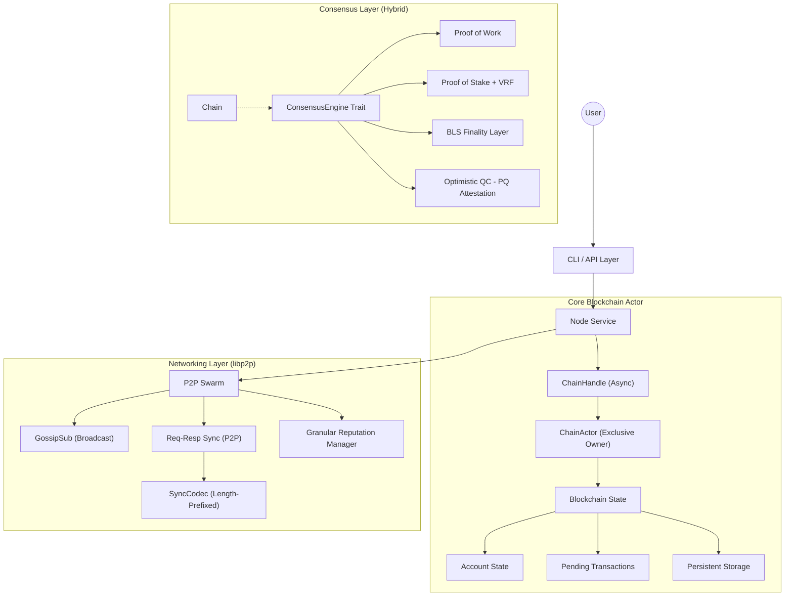

# Budlum Blockchain Core

**Budlum Core** is a modular blockchain framework written in Rust. It serves as a high-performance Layer-1 blockchain featuring pluggable consensus engines (PoW, PoS, PoA), a hardened libp2p-based networking stack, an atomic account-based state model, and BudZKVM-backed contract execution.

The architecture emphasizes **security**, **modularity**, and **readability**, making it an ideal foundation for custom blockchain networks, protocol experiments, or educational study of advanced distributed ledger technology. With the latest hardening passes, the framework is robust against spam, malformed payloads, inconsistent replay, and stale canonical metadata after reorgs.

---

## 📚 Table of Contents

- [Architecture Overview](#architecture-overview)
- [Quick Start](#quick-start)
- [Production Hardening](#-production-hardening)
- [Core Components Deep Dive](#core-components-deep-dive)
    - [1. Data Structures](#1-data-structures)
    - [2. Consensus Engines](#2-consensus-engines)
    - [3. Mempool & Anti-Spam](#3-mempool--anti-spam)
    - [4. Networking Layer](#4-networking-layer)
    - [5. State Management](#5-state-management)
    - [6. Cryptography & Security](#6-cryptography--security)
- [CLI Reference](#cli-reference)
- [Development Guide](#development-guide)

---

## 🏗️ Architecture Overview

Budlum Core follows a layered architecture where modules are loosely coupled through Rust `traits`.



### Module Responsibilities

| Module | Source File | Description |
| :--- | :--- | :--- |
| **CLI** | `src/cli/` | Command line argument parsing and node configuration. |
| **Core** | `src/core/` | Fundamental types: `Block`, `Transaction`, `Account`, `ChainConfig`. |
| **Chain** | `src/chain/` | Blockchain logic, `ChainActor` (exclusive state owner), and snapshots. |
| **Network** | `src/network/` | P2P stack (libp2p), node discovery, and protocol logic. |
| **RPC** | `src/rpc/` | JSON-RPC 2.0 implementation with `bud_` standard methods. |
| **Consensus** | `src/consensus/` | Implementations of PoW, PoS, PoA, and Finality gadgets. |
| **Storage** | `src/storage/` | Persistent sled database layer, migrations, and snapshot export. |
| **Execution** | `src/execution/` | State transition engine, block application, and BudZKVM contract execution. |
| **Mempool** | `src/mempool/` | Validating transaction pool with fee-based prioritization. |
| **Tests** | `src/tests/` | Comprehensive integration and **Chaos Engineering** suites. |

---

## ⚡ Quick Start

### Prerequisites
- **Rust Toolchain**: `1.70.0+`
- **Dependencies**: `protoc` (Protocol Buffers compiler)

### Build
```bash
git clone https://github.com/rade/budlum-core.git
cd budlum-core
cargo build --release
```

### Running a Node

**1. Proof of Work (Miner)**
```bash
./target/release/budlum-core --consensus pow --difficulty 3 --port 4001
```

**2. Proof of Stake (Validator)**
```bash
./target/release/budlum-core --consensus pos --min-stake 5000 --db-path ./data/pos_node
```

**3. Join an Existing Network (Bootstrap)**
```bash
./target/release/budlum-core --bootstrap /ip4/127.0.0.1/tcp/4001/p2p/12D3K...
```

**4. Run With a Network Config**
```bash
./target/release/budlum-core --config config/devnet.toml
./target/release/budlum-core --config config/testnet.toml
```

Mainnet refuses to start without at least one configured bootnode. Fill `[bootnodes].addresses` in `config/mainnet.toml` or pass `--bootstrap`.

---

---

### 🟢 Production Hardening

Budlum Core has undergone a rigorous production-readiness audit and is now equipped with advanced features for scale, security, and governance:

-   **Cryptographic BLS Finality**: Mandatory BFT finality gadget using aggregate BLS12-381 signatures for immutable checkpoints.
-   **On-Chain Governance**: Stake-weighted voting protocol for real-time network parameter updates (fees, rewards, etc.) without hard forks.
-   **Fast Sync (Snapshot-Based)**: Protocol for rapid node discovery and state synchronization using chunked P2P transfers. (See [Ch 5.3](docs/book/ch05_03_snapshots.md))
-   **Database Integrity Audit (FSCK)**: Built-in tool for verifying blockchain data consistency (`--check-db`) and self-repairing index corruptions (`--repair-db`). (See [Ch 5.1](docs/book/ch05_01_storage.md))
-   **Deterministic Economics**: All reward and slashing calculations use **Saturating Fixed-Point Math** (`u64`).
-   **Deterministic Slot-Timestamps**: Block timestamps are derived from `genesis_time + (index * SLOT_MS)`.
-   **Deterministic Replay / Reorg Recovery**:
    *   Restart and reorg state rebuilds now replay the same block-level effects as live execution.
    *   Rewards, slashing, epoch transitions, and dynamic fee updates remain consistent across recovery paths.
-   **Atomic Persistence & State Resilience**:
    *   Consensus state (seen blocks, checkpoints, seeds) is persisted to `sled`.
    *   Mempool transactions are persisted to disk to survive reboots.
    *   Reorgs rewrite canonical metadata through the same commit path used for normal blocks, including `TX_IDX`, `STATE_ROOT`, and tip tracking.
    *   **Unwrap Audit**: 50+ potential panic points were replaced with robust error handling for 24/7 uptime.
-   **Queued Nonce Mempool**:
    *   The mempool accepts sequential pending nonces from the same sender.
    *   Block assembly simulates transactions against a temporary state so nonce order remains valid while fees still drive selection.
-   **PoA Wiring**:
    *   `validators.json` is loaded into the in-state validator set at node startup.
    *   Local signer keys are reused by the CLI mining path so the reward address and block producer stay aligned.
-   **Merkle Tree Security (Incremental & Optimized)**:
    *   **Domain Separation**: Uses `0x00` prefixes for leaves and `0x01` for internal nodes.
    *   **Incremental Updates**: State root calculation is $O(\log N)$ using a cached Merkle Tree and dirty-account tracking.
-   **Binary Optimization**:
    *   **32-Byte Addressing**: All addresses are handled as raw 32-byte arrays instead of hex strings, reducing memory by 50% and eliminating hex-parsing overhead.
    *   **Binary Hashing**: Transaction and Block hashing now operates directly on bytes for maximum efficiency.
-   **RPC Hardening**: Strict input validation for transaction sizes, signatures, payload limits (2MB), and mempool-aware prechecks via `bud_txPrecheck`.
-   **BudZKVM Contract Execution**:
    *   `TransactionType::ContractCall` carries BudZKVM bytecode in `tx.data`.
    *   `src/execution/zkvm.rs` decodes 8-byte instructions, executes them with a gas limit, produces a STARK proof, and verifies it before the transaction mutates account state.
    *   Failed VM execution, malformed bytecode, or proof verification failure rejects the transaction without charging fee or advancing nonce.
    *   P2P protobuf encoding preserves the `CONTRACT_CALL` transaction type for network propagation.
-   **Network-Specific Profiles**: `mainnet`, `testnet`, and `devnet` now have distinct chain IDs, ports, consensus parameters, mempool limits, gas schedules, security limits, and genesis configs.
-   **Mainnet Bootnode Guard**: Placeholder bootnodes were removed. Mainnet startup requires an explicit real bootnode from config or CLI.
-   **Protocol Isolation**: P2P handshakes now reject wrong chain IDs and incompatible protocol versions before accepting peer traffic.
-   **Schema Migration Hook**: Storage initialization applies a schema version marker and exposes a snapshot export helper for backup workflows.

---

## 🔍 Core Components Deep Dive

### 1. Data Structures

The fundamental primitives of the Budlum blockchain are **Blocks** and **Transactions**.

#### Block (`src/block.rs`)
A block contains a header and a body of transactions.
- **`index`**: height of the block (genesis = 0).
- **`hash`**: SHA3-256 hash of the block content.
- **`previous_hash`**: Link to the parent block.
- **`producer`**: Ed25519 Public Key of the node that created the block.
- **`signature`**: Ed25519 Signature of the block hash by the producer. (Placebo `stake_proof` implementations were purged to enforce pure intrinsic signature validation).
- **`chain_id`**: Network identifier to prevent cross-chain replay.
- **`transactions`**: A vector of `Transaction` objects.

#### Transaction (`src/core/transaction.rs`)
A state-changing directive signed by a wallet.
- **`from`/`to`**: 32-byte binary `Address` (Type-safe, memory-efficient).
- **`nonce`**: Sequence number. Must strictly increment (0, 1, 2...) for valid processing.
- **`signature`**: Signs `hash(from, to, amount, fee, nonce, data, timestamp, chain_id)` using Ed25519.
- **`tx_type`**: Includes `Transfer`, `Stake`, `Unstake`, `Vote`, and `ContractCall`.
- **`data`**: For `ContractCall`, this is raw BudZKVM bytecode encoded as little-endian `u64` instructions.
- **Atomic Execution**: If any transaction fails cryptographic checks or safe-math bounds, the execution fails and the block is rejected.

#### BudZKVM Contract Calls (`src/execution/zkvm.rs`)
Contract execution is wired into the normal L1 block path:
- A `ContractCall` transaction must have `amount == 0` and non-empty bytecode with a length divisible by 8.
- The executor runs the bytecode in `bud-vm` with `DEFAULT_CONTRACT_GAS_LIMIT`.
- A proof is generated and verified through `bud-proof` before sender fee/nonce state is updated.
- Out-of-gas, malformed bytecode, VM panic, or proof failure rejects the transaction atomically.

---

### 2. Consensus Engines

Budlum abstracts consensus into the `ConsensusEngine` trait.

#### Proof of Stake (PoS) & VRF (`src/consensus/pos.rs`)
- **Selection**: Uses Verifiable Random Functions for unbiased, secure proposers. Thresholding is proportional to stake, ensuring fairness.
- **Slashing**: Detects **Double-Proposals** and **Double-Signatures**.

#### BLS Finality Layer (`src/consensus/finality.rs`)
- **BFT Consensus**: Adds a gadget on top of PoS to finalize blocks via aggregate signatures.
- **Checkpoints**: Every 100 blocks, a mandatory quorum vote seals the chain's past forever.

#### Optimistic QC (`src/consensus/qc.rs`)
- **Post-Quantum Security**: Implements Dilithium-based attestations.
- **Fraud Proofs**: Nodes can challenge invalid PQ attestations by submitting Merkle proofs of invalid signatures.

#### Proof of Work (PoW) (`src/consensus/pow.rs`)
- **Algorithm**: Standard SHA3-256 Hashcash.
- **Validation**: Ensures blocks compute properly, and `cumulative difficulty` overrides trivial chain lengths for more sophisticated fork choices. Adaptive retargeting applies block delays.

#### Proof of Authority (PoA) (`src/consensus/poa.rs`)
- **Permissioned**: Validators are loaded from `validators.json` into the in-memory validator set at startup.
- **Round-Robin**: Validators produce blocks in a strict rotation (`height % validator_count`).
- **Signer-Aware CLI**: Local validator keys can be loaded so manual block production uses the same producer identity as the consensus signer.

---

### 3. Mempool & Anti-Spam (`src/mempool/pool.rs`)

A structured transaction pool with advanced spam protection.

#### Features
- **Fee-Based Ordering**: Transactions sorted by fee (highest first).
- **Replace-By-Fee (RBF)**: Higher-fee tx replaces same-nonce tx (+10% bump required).
- **Queued Nonces**: Sequential pending transactions from the same sender are accepted and evaluated against projected sender state.
- **Anti-Spam Rules**:
  - Max 16 pending transactions per sender.
  - Minimum fee enforcement.
  - Duplicate rejection.
- **TTL Expiration**: Stale transactions auto-removed.

---

### 4. Genesis & Monetary Policy (`src/chain/genesis.rs`)

Deterministic genesis blocks and economic parameters are network-specific.

#### GenesisConfig
```rust
GenesisConfig {
    chain_id: 1337,
    allocations: vec![("address", amount)],  // Initial balances
    validators: vec!["pubkey1", "pubkey2"],  // Initial validators
    block_reward: 50,
    base_fee: 1,
    gas_schedule: Network::Devnet.gas_schedule(),
    timestamp: 0,
}
```

#### Network Profiles
- `mainnet`: chain ID `1`, PoS defaults, stricter mempool/security limits, non-placeholder bootnodes required.
- `testnet`: chain ID `42`, PoS defaults with lower stake and faster slots.
- `devnet`: chain ID `1337`, local-friendly defaults and no required bootnodes.

---

### 4. Networking Layer

Budlum uses the **libp2p** stack to ensure robust, decentralized peer-to-peer communication.

#### Sync Protocol & Reorg Orchestration
Headers-first synchronization for efficient chain sync and fork-resolution:
- `GetHeaders` / `Headers`: Multi-step exponential locators calculate accurate fork-points.
- `BlocksRange`: Rapid batch delivery mechanisms matching chain height.
- `try_reorg()`: Evaluates cumulative difficulty and automates local chain truncations to adopt the heaviest canonical chain without node freezes.
- `GetStateSnapshot` / `SnapshotChunk`: State snapshot sync.

#### Protocol Messages
Defined in `src/network/protocol.rs` and `proto/protocol.proto`:
- `Handshake` / `HandshakeAck`: Protocol version and validator set hash verification.
- `Block(Block)` / `Transaction(Transaction)`: Core data propagation.
- **Finality**: `Prevote`, `Precommit`, and `FinalityCert` (BLS-aggregated).
- **QC**: `GetQcBlob` and `QcBlobResponse` (Dilithium-indexed).

#### Serialization & Efficiency
Budlum has migrated to **Protobuf** for P2P messaging to ensure minimal overhead and cross-language compatibility. Determinisitic serialization for consensus state uses **Bincode**.

#### DoS Protection: Peer Scoring
To prevent spam and attacks, the `PeerManager` (`src/network/peer_manager.rs`) assigns scores and Token-Bucket capacities:
- **Valid Block**: +1
- **Invalid Block**: -20
- **Oversized Message / Spam**: Rate Limited Token Deductions / Bans
- **Ban Threshold**: -100 (1 Hour Ban)

---

### 5. State Management

Budlum uses an Account-based model (like Ethereum), not UTXO (like Bitcoin).

#### Storage (`src/storage/db.rs`)
Data is persisted in **sled**, a high-performance embedded database.
- **`{hash}`**: Stores serialized block data.
- **`LAST`**: Stores the hash of the chain tip.
- **`SCHEMA_VERSION`**: Tracks database schema migrations.
- **`STATE_ROOT:{height}`**: Stores canonical state roots.
- **`TX_IDX:{hash}`**: Stores transaction-to-height lookup entries.
- **Snapshots**: Stored separately by the snapshot/pruning subsystem.

#### Snapshots & Pruning (`src/snapshot.rs`)
- **Snapshot Loop**: Every 1000 blocks, the node saves a snapshot of all balances.
- **Pruning**: Blocks older than `2 * max_reorg_depth` (200 blocks) can be pruned to save disk space, as long as a valid snapshot exists ahead of them.
- **Replay Safety**: Restart and reorg recovery reuse the same block-effect pipeline as live execution, keeping replayed state deterministic.

---

### 6. Cryptography & Security

#### Standards
- **Signatures**:
    - **Ed25519**: Primary signature for transactions and basic block identity.
    - **BLS (bls12_381)**: Multi-signature aggregation for finality voting.
    - **Dilithium**: Post-Quantum attestation for long-term security.
- **Hashing**: **SHA3-256** (Keccak).
- **Proof of Possession (PoP)**: Mandated for BLS key registration to prevent rogue-key attacks.

#### Domain Separation
We prefix all hashes to prevent context confusion attacks.
- Block Hash Prefix: `BDLM_BLOCK_V2` (includes state_root)
- TX Hash Prefix: `BDLM_TX_V2`
- State Root Prefix: `BDLM_STATE_V1`

#### Chain ID
Every transaction is signed with a specific `chain_id`.
- Mainnet: `1`
- Testnet: `42`
- Devnet: `1337`
This ensures a transaction meant for Testnet cannot be replayed on Mainnet.

#### Validator Key Policy
`src/crypto/primitives.rs` defines key backend policies for local files, HSM slots, threshold signing, and air-gapped cold storage. Mainnet defaults describe a non-exportable HSM policy; operators still need to wire their actual HSM or signer service before launch.

---

## 💻 CLI Reference

Usage: `cargo run -- [OPTIONS]`

| Flag | Description | Default |
| :--- | :--- | :--- |
| `--consensus <TYPE>` | `pow` `pos` `poa` | `pow` |
| `--network <NAME>` | `mainnet` `testnet` `devnet` | `devnet` |
| `--config <PATH>` | TOML config file (`config/mainnet.toml`, `config/testnet.toml`, `config/devnet.toml`) | `None` |
| `--rpc-host <ADDR>` | JSON-RPC listen address | `127.0.0.1` |
| `--rpc-port <PORT>` | JSON-RPC listen port | `8545` |
| `--port <PORT>` | P2P Listen Port | Auto-adjusts per network |
| `--db-path <PATH>` | Database Directory | `./data/budlum.db` |
| `--difficulty <N>` | Mining Difficulty (PoW) | `2` |
| `--min-stake <AMT>` | Minimum Stake (PoS) | `1000` |
| `--validator-address` | Address to mine/validate for | `None` |
| `--bootstrap <ADDR>` | Peer multiaddr to join | `None` |
| `--check-db` | Run Database Integrity Audit | `false` |
| `--repair-db` | Rebuild indexes from raw block data | `false` |

---

## 🛠️ Development Guide

### Running Tests
Budlum has extensive unit, integration, and chaos tests (**135 tests**).
```bash
nix develop --command cargo test
```

**Key Test Suites:**
- `integration_tests`: Simulates full node interactions.
- `consensus::pos::tests`: Validates slashing and staking logic.
- `network::peer_manager::tests`: Validates banning logic and token limits.

### Code Style
- Format: `cargo fmt`
- Lint: `cargo clippy`

---

## 📄 License
MIT License. Copyright (c) 2026 The Budlum Developers.
