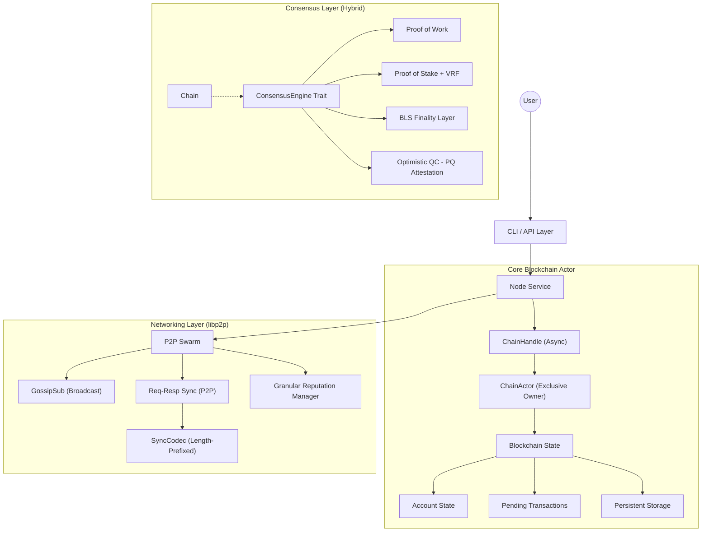

# Budlum Blockchain Core

**Budlum Core** is a production-grade, modular blockchain framework written in Rust. It serves as a high-performance Layer-1 blockchain featuring pluggable consensus engines (PoW, PoS, PoA), a hardened libp2p-based networking stack, and an atomic, account-based state model.

The architecture emphasizes **security**, **modularity**, and **readability**, making it an ideal foundation for custom blockchain networks or educational study of advanced distributed ledger technology. With the latest Mainnet Hardening phases, the framework is incredibly robust against spam, DDOS, and chain manipulation.

---

## 📚 Table of Contents

- [Architecture Overview](#architecture-overview)
- [Quick Start](#quick-start)
- [Mainnet Hardening (Production Ready)](#mainnet-hardening-features)
- [Core Components Deep Dive](#core-components-deep-dive)
    - [1. Data Structures](#1-data-structures)
    - [2. Consensus Engines](#2-consensus-engines)
    - [3. Mempool & Anti-Spam](#3-mempool--anti-spam)
    - [4. Networking Layer](#4-networking-layer)
    - [5. State Management](#5-state-management)
    - [6. Cryptography & Security](#6-cryptography--security)
- [CLI Reference](#cli-reference)
- [Development Guide](#development-guide)

---

## 🏗️ Architecture Overview

Budlum Core follows a layered architecture where modules are loosely coupled through Rust `traits`.



### Module Responsibilities

| Module | Source File | Description |
| :--- | :--- | :--- |
| **CLI** | `src/cli/` | Command line argument parsing and node configuration. |
| **Core** | `src/core/` | Fundamental types: `Block`, `Transaction`, `Account`, `ChainConfig`. |
| **Chain** | `src/chain/` | Blockchain logic, `ChainActor` (exclusive state owner), and snapshots. |
| **Network** | `src/network/` | P2P stack (libp2p), node discovery, and protocol logic. |
| **RPC** | `src/rpc/` | JSON-RPC 2.0 implementation with `bud_` standard methods. |
| **Consensus** | `src/consensus/` | Implementations of PoW, PoS, PoA, and Finality gadgets. |
| **Storage** | `src/storage/` | Persistent database layer (RocksDB/DumbDB). |
| **Execution** | `src/execution/` | State transition engine and block application. |
| **Mempool** | `src/mempool/` | Validating transaction pool with fee-based prioritization. |
| **Tests** | `src/tests/` | Comprehensive integration and **Chaos Engineering** suites. |

---

## ⚡ Quick Start

### Prerequisites
- **Rust Toolchain**: `1.70.0+`
- **Dependencies**: `protoc` (Protocol Buffers compiler)

### Build
```bash
git clone https://github.com/rade/budlum-core.git
cd budlum-core
cargo build --release
```

### Running a Node

**1. Proof of Work (Miner)**
```bash
./target/release/budlum-core --consensus pow --difficulty 3 --port 4001
```

**2. Proof of Stake (Validator)**
```bash
./target/release/budlum-core --consensus pos --min-stake 5000 --db-path ./data/pos_node
```

**3. Join an Existing Network (Bootstrap)**
```bash
./target/release/budlum-core --bootstrap /ip4/127.0.0.1/tcp/4001/p2p/12D3K...
```

---

### 🔴 Performance & Scalability
- **Incremental Merkle State Root**: Replaced full-state hashing ($O(N)$) with a **Dirty-Tracking Incremental Trie**. Only modified account paths are re-computed, enabling sub-millisecond state roots even with millions of accounts.
- **Per-Account State Persistence**: Migrated from single-blob JSON storage to granular, key-value based account persistence (`ACCT:{pubkey}`). This eliminates the I/O bottleneck of serializing the entire state on every block.
- **Atomic Batched Storage I/O**: Integrated `sled::Batch` for block insertions and deletions. All indices (Height, StateRoot, TX Index) are updated atomically, preventing database corruption during hardware failures.
- **Mempool Persistence**: Pending transactions are now persisted to disk. The node automatically restores the mempool on restart, preventing transaction loss during reboots.
- **O(1) Transaction Indexing**: Added a global transaction index (`TX_IDX:{hash}`). Transaction lookups and receipt queries are now constant-time, regardless of chain length.
- **Actor-Based Concurrency**: Migrated from `Arc<Mutex<Blockchain>>` to a lock-free **Actor Model**. The `ChainActor` exclusively manages state, eliminating lock contention between the Networking, RPC, and Mining loops.
- **Request-Response Synchronization**: Replaced high-overhead Gossip broadcasts for block sync with a robust **libp2p Request-Response protocol**. Every node queries headers and blocks point-to-point, ensuring faster and more predictable chain convergence.
- **High-Performance Benchmarking**: Integrated a dedicated `bench_performance` tool capable of measuring real-world TPS under heavy load, identifying and eliminating bottlenecks in hashing and state transition paths.

### 🟠 Security & Network Stability
- **Dynamic Fee Market (EIP-1559 Style)**: Implemented a proportional `base_fee` mechanism. Fees automatically adjust (±12.5%) based on block congestion, providing native protection against pennyspam DoS.
- **Granular Peer Reputation Scoring**: The `PeerManager` now tracks and penalizes "soft" failures:
    - **Timeout**: -15 score
    - **Slow Sync**: -5 score
    - **Invalid Handshake**: -20 score
- **Verifiable Random Functions (VRF)**: Proposer selection in PoS is cryptographically hidden and unbiased, preventing strategic DoS attacks on upcoming leaders.

### 🟡 Operational & UX
- **TOML Configuration Support**: Nodes can now be fully configured via `budlum.toml`, allowing complex network and validator tuning without massive CLI flags.
- **Prometheus Metrics Standard**: Native exporter for block time, peer count, mempool size, and reorg depth, enabling high-availability monitoring.
- **Chaos Engineering & Benchmarking**: 
    - **`chaos.rs`**: Simulates network partitions, floods, and state corruption.
    - **`bench_performance.rs`**: Measures peak TPS by bypassing network I/O.
    - **Run Benchmark**: `cargo test bench_high_tps -- --nocapture`

### 🟢 Production Hardening (Mainnet Ready)
- **Atomic Persistence**: Every block commit uses `sled::Batch` to ensure atomicity across block data, indices, and state roots.
- **Network Guardrails**: 
    - **`MAX_PEERS` (50)**: Strict limit to prevent resource exhaustion.
    - **Active Banning**: Integrated reputation system with 1-hour automated bans for malicious peers.
    - **DHT Self-Healing**: Periodic 5-minute Kademlia bootstrapping to maintain network health.

---

## 🔍 Core Components Deep Dive

### 1. Data Structures

The fundamental primitives of the Budlum blockchain are **Blocks** and **Transactions**.

#### Block (`src/block.rs`)
A block contains a header and a body of transactions.
- **`index`**: height of the block (genesis = 0).
- **`hash`**: SHA3-256 hash of the block content.
- **`previous_hash`**: Link to the parent block.
- **`producer`**: Ed25519 Public Key of the node that created the block.
- **`signature`**: Ed25519 Signature of the block hash by the producer. (Placebo `stake_proof` implementations were purged to enforce pure intrinsic signature validation).
- **`chain_id`**: Network identifier to prevent cross-chain replay.
- **`transactions`**: A vector of `Transaction` objects.

#### Transaction (`src/transaction.rs`)
A state-changing directive signed by a wallet.
- **`from`/`to`**: Ed25519 Public Keys (Hex).
- **`nonce`**: Sequence number. Must strictly increment (0, 1, 2...) for valid processing.
- **`signature`**: Signs `hash(from, to, amount, fee, nonce, data, chain_id)`.
- **Atomic Execution**: If any transaction fails cryptographic checks (or has invalid bounds for timestamp +15 seconds past server time), the execution fails.

---

### 2. Consensus Engines

Budlum abstracts consensus into the `ConsensusEngine` trait.

#### Proof of Stake (PoS) & VRF (`src/consensus/pos.rs`)
- **Selection**: Uses Verifiable Random Functions for unbiased, secure proposers. Thresholding is proportional to stake, ensuring fairness.
- **Slashing**: Detects **Double-Proposals** and **Double-Signatures**.

#### BLS Finality Layer (`src/consensus/finality.rs`)
- **BFT Consensus**: Adds a gadget on top of PoS to finalize blocks via aggregate signatures.
- **Checkpoints**: Every 100 blocks, a mandatory quorum vote seals the chain's past forever.

#### Optimistic QC (`src/consensus/qc.rs`)
- **Post-Quantum Security**: Implements Dilithium-based attestations.
- **Fraud Proofs**: Nodes can challenge invalid PQ attestations by submitting Merkle proofs of invalid signatures.

#### Proof of Work (PoW) (`src/consensus/pow.rs`)
- **Algorithm**: Standard SHA3-256 Hashcash.
- **Validation**: Ensures blocks compute properly, and `cumulative difficulty` overrides trivial chain lengths for more sophisticated fork choices. Adaptive retargeting applies block delays.

#### Proof of Authority (PoA) (`src/consensus/poa.rs`)
- **Permissioned**: Only keys in `validators.json` can sign.
- **Round-Robin**: Validators produce blocks in a strict rotation (`height % validator_count`).

---

### 3. Mempool & Anti-Spam (`src/mempool.rs`)

A structured transaction pool with advanced spam protection.

#### Features
- **Fee-Based Ordering**: Transactions sorted by fee (highest first).
- **Replace-By-Fee (RBF)**: Higher-fee tx replaces same-nonce tx (+10% bump required).
- **Anti-Spam Rules**:
  - Max 16 pending transactions per sender.
  - Minimum fee enforcement.
  - Duplicate rejection.
- **TTL Expiration**: Stale transactions auto-removed.

---

### 4. Genesis & Monetary Policy (`src/genesis.rs`)

Deterministic genesis block (TIMESTAMP = 0) and economic parameters.

#### GenesisConfig
```rust
GenesisConfig {
    chain_id: 1337,
    allocations: vec![("address", amount)],  // Initial balances
    validators: vec!["pubkey1", "pubkey2"],  // Initial validators
    block_reward: 50,
    base_fee: 1,
}
```

#### Economic Constants
- `BLOCK_REWARD`: 50 BDLM per block
- `BASE_FEE`: 1 BDLM minimum transaction fee

---

### 4. Networking Layer

Budlum uses the **libp2p** stack to ensure robust, decentralized peer-to-peer communication.

#### Sync Protocol & Reorg Orchestration
Headers-first synchronization for efficient chain sync and fork-resolution:
- `GetHeaders` / `Headers`: Multi-step exponential locators calculate accurate fork-points.
- `BlocksRange`: Rapid batch delivery mechanisms matching chain height.
- `try_reorg()`: Evaluates cumulative difficulty and automates local chain truncations to adopt the heaviest canonical chain without node freezes.
- `GetStateSnapshot` / `SnapshotChunk`: State snapshot sync.

#### Protocol Messages
Defined in `src/network/protocol.rs` and `proto/protocol.proto`:
- `Handshake` / `HandshakeAck`: Protocol version and validator set hash verification.
- `Block(Block)` / `Transaction(Transaction)`: Core data propagation.
- **Finality**: `Prevote`, `Precommit`, and `FinalityCert` (BLS-aggregated).
- **QC**: `GetQcBlob` and `QcBlobResponse` (Dilithium-indexed).

#### Serialization & Efficiency
Budlum has migrated to **Protobuf** for P2P messaging to ensure minimal overhead and cross-language compatibility. Determinisitic serialization for consensus state uses **Bincode**.

#### DoS Protection: Peer Scoring
To prevent spam and attacks, the `PeerManager` (`src/network/peer_manager.rs`) assigns scores and Token-Bucket capacities:
- **Valid Block**: +1
- **Invalid Block**: -20
- **Oversized Message / Spam**: Rate Limited Token Deductions / Bans
- **Ban Threshold**: -100 (1 Hour Ban)

---

### 5. State Management

Budlum uses an Account-based model (like Ethereum), not UTXO (like Bitcoin).

#### Storage (`src/storage.rs`)
Data is persisted in **sled**, a high-performance embedded database.
- **`BLOCK:{hash}`**: Stores serialized block data.
- **`LAST`**: Stores the hash of the chain tip.
- **`SNAPSHOT:{height}`**: Stores compressed `AccountState`.

#### Snapshots & Pruning (`src/snapshot.rs`)
- **Snapshot Loop**: Every 1000 blocks, the node saves a snapshot of all balances.
- **Pruning**: Blocks older than `2 * max_reorg_depth` (200 blocks) can be pruned to save disk space, as long as a valid snapshot exists ahead of them.

---

### 6. Cryptography & Security

#### Standards
- **Signatures**:
    - **Ed25519**: Primary signature for transactions and basic block identity.
    - **BLS (bls12_381)**: Multi-signature aggregation for finality voting.
    - **Dilithium**: Post-Quantum attestation for long-term security.
- **Hashing**: **SHA3-256** (Keccak).
- **Proof of Possession (PoP)**: Mandated for BLS key registration to prevent rogue-key attacks.

#### Domain Separation
We prefix all hashes to prevent context confusion attacks.
- Block Hash Prefix: `BDLM_BLOCK_V2` (includes state_root)
- TX Hash Prefix: `BDLM_TX_V1`
- State Root Prefix: `BDLM_STATE_V1`

#### Chain ID
Every transaction is signed with a specific `chain_id`.
- Mainnet: `1`
- Testnet: `42`
- Devnet: `1337`
This ensures a transaction meant for Testnet cannot be replayed on Mainnet.

---

## 💻 CLI Reference

Usage: `cargo run -- [OPTIONS]`

| Flag | Description | Default |
| :--- | :--- | :--- |
| `--consensus <TYPE>` | `pow` `pos` `poa` | `pow` |
| `--network <NAME>` | `mainnet` `testnet` `devnet` | `devnet` |
| `--rpc-host <ADDR>` | JSON-RPC listen address | `127.0.0.1` |
| `--rpc-port <PORT>` | JSON-RPC listen port | `8545` |
| `--port <PORT>` | P2P Listen Port | `4001` (Auto-adjusts per network) |
| `--db-path <PATH>` | Database Directory | `./data/budlum.db` |
| `--difficulty <N>` | Mining Difficulty (PoW) | `2` |
| `--min-stake <AMT>` | Minimum Stake (PoS) | `1000` |
| `--validator-address` | Address to mine/validate for | `None` |
| `--bootstrap <ADDR>` | Peer multiaddr to join | `None` |

---

## 🛠️ Development Guide

### Running Tests
Budlum has extensive unit, integration, and chaos tests (126 tests).
```bash
cargo test
```

**Key Test Suites:**
- `integration_tests`: Simulates full node interactions.
- `consensus::pos::tests`: Validates slashing and staking logic.
- `network::peer_manager::tests`: Validates banning logic and token limits.

### Code Style
- Format: `cargo fmt`
- Lint: `cargo clippy`

---

## 📄 License
MIT License. Copyright (c) 2026 The Budlum Developers.
