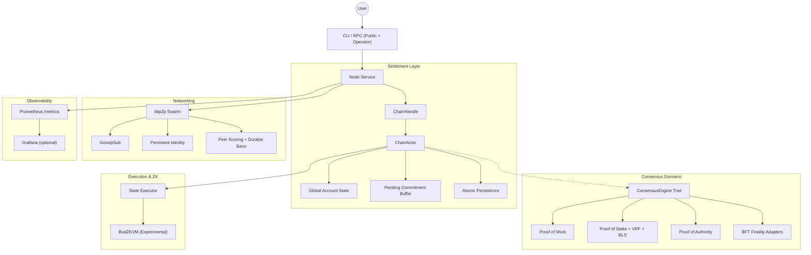

# ⚡ Budlum Core

> **A controlled public-devnet candidate for Layer-1 blockchain research: modular, deterministic, and multi-consensus native.**

[](https://github.com/rade/budlum-core)
[](https://github.com/rade/budlum-core)
[](https://opensource.org/licenses/MIT)
[](https://www.rust-lang.org/)

---

> [!CAUTION]
> **Controlled Public Devnet Candidate (v0.6-dev)**
>
> Budlum Core is suitable for controlled public devnet experiments with clear risk disclaimers. It is **NOT** audited mainnet software, has not completed professional security review, and should **NOT** be used for financial transactions or production applications carrying real value.

---

Budlum Core is a Rust-based Layer-1 blockchain framework designed for engineers and protocol researchers who want to explore modular consensus, deterministic state settlement, and cross-domain interoperability.

If this project helps your research, please support it:
⭐ **Star the repo** | 🍴 **Fork it** | 🧠 **Open a discussion**

---

## 🏗️ Architectural Vision

Most blockchain frameworks are optimized for a single consensus worldview. Budlum is designed as a **Universal Settlement Layer** to research how heterogeneous networks (PoW, PoS, BFT) can achieve deterministic state convergence without centralized intermediaries.

### Why Budlum?
- 🔁 **Heterogeneous Settlement**: Infrastructure for running parallel consensus domains (PoW, PoS, BFT) on a unified settlement layer.
- 🎯 **Deterministic Cross-Domain Ordering**: Commitments from independently finalized domains are settled in a fixed domain-id order, not network arrival order — two nodes that received the same commitments in a different sequence converge to bit-identical global state.
- 🧾 **Block-Level Settlement Replay**: Blocks carry the exact per-domain settlement watermarks their producer applied, hashed into the block itself — a validator replays that same bounded batch instead of independently deciding how much domain data to settle, so it reaches byte-identical state rather than racing ahead or falling behind.
- 🔐 **Real Finality Verification**: PoW commitments require an independently-verified proof-of-work header chain; PoA/BFT/PoS commitments require a genuine BLS aggregate-signature quorum over a domain's registered validator set — none of it is a self-reported claim. Every proof now binds the commitment's full payload (including `state_root`), not just its raw block hash, so a valid proof can't be replayed against a different settlement batch.
- 🌉 **Verified Trustless Interop**: Experimental bridge flow where lock, mint, burn, and unlock are tied to committed domain events and Merkle proofs.
- 🧠 **Tamper-Evident State Transitions**: A domain's `state_updates` are bound to its `state_root` via Merkle root, so an already-finality-proven commitment can't have its account updates swapped out independently.
- 🧩 **Modular Core**: Decoupled consensus, networking, and execution layers for rapid prototyping.
- 🌐 **P2P Native**: Built on `libp2p` with GossipSub, persistent identity, DNS seed resolution, and durable peer banning.
- 🛡️ **BLS Finality**: Two-phase BLS-signed prevote/precommit protocol with aggregated signature verification and auto-precommit.
- 🩺 **Dual RPC**: Separate public and operator JSON-RPC 2.0 listeners with health endpoints, per-IP rate limiting, and trusted-proxy enforcement.
- 📦 **Deployment Ready**: Docker multi-stage image, docker-compose 4-node devnet, systemd unit, and Prometheus metrics collectors.
- 🛠️ **Developer First**: Book-style technical documentation, JSON-RPC reference material, and a growing adversarial test suite.

---

## 🏗️ Architecture Overview


```mermaid
graph TD
    User(("User")) --> CLI["CLI / RPC (Public + Operator)"]
    CLI --> Node["Node Service"]

    subgraph "Settlement Layer"
        Node --> ChainHandle["ChainHandle"]
        ChainHandle --> ChainActor["ChainActor"]
        ChainActor --> State["Global Account State"]
        ChainActor --> Buffer["Pending Commitment Buffer"]
        ChainActor --> Storage["Atomic Persistence"]
    end

    subgraph "Consensus Domains"
        ChainActor -.-> Engine["ConsensusEngine Trait"]
        Engine --> PoW["Proof of Work"]
        Engine --> PoS["Proof of Stake + VRF + BLS"]
        Engine --> PoA["Proof of Authority"]
        Engine --> BFT["BFT Finality Adapters"]
    end

    subgraph "Execution & ZK"
        ChainActor --> Executor["State Executor"]
        Executor --> ZKVM["BudZKVM (Experimental)"]
    end

    subgraph "Networking"
        Node --> Libp2p["libp2p Swarm"]
        Libp2p --> Gossip["GossipSub"]
        Libp2p --> Identity["Persistent Identity"]
        Libp2p --> Reputation["Peer Scoring + Durable Bans"]
    end

    subgraph "Observability"
        Node --> Metrics["Prometheus /metrics"]
        Metrics --> Grafana["Grafana (optional)"]
    end
```

---

## 🧩 Devnet Candidate Features (v0.6)

### 🎯 Deterministic Multi-Domain Settlement (v0.4)
- **Arrival-Order Independence**: Domain commitments are recorded into their own domain's history immediately (equivocation-checked, per-domain sequential), but applying their `state_updates` to global account state is deferred to `settle_pending_domain_commitments`, which processes every registered domain in fixed ascending `domain_id` order — not the order commitments happened to arrive over the network.
- **Deterministic Conflict Resolution**: If two domains race to update the same account, the lowest-`domain_id` commitment always wins on every node; the "losing" commitment stays validly recorded in its own domain's history, only its specific stale update is skipped.
- **Settlement Anchored to Block Production**: Settlement runs at the start of `produce_block()`, tying it to the network's already-agreed-upon block ordering rather than to whenever a commitment happens to arrive.

### 🧾 Block-Level Settlement Replay (v0.5)
- **The gap this closes**: through v0.4, a receiving validator recomputed settlement from its *own* view of recorded domain commitments — which could differ from the producer's (e.g. having already received later domain data, or still missing some), causing valid blocks to be rejected or, in principle, causing silent divergence outside what `state_root` alone could catch.
- **Settlement Watermarks**: `Block` now carries `settlement_watermarks` (each domain's `last_settled_height` after the producer's settlement pass) and a `settlement_batch_root` binding them into the block hash.
- **Bounded Replay, Not Independent Recomputation**: `validate_and_add_block` replays settlement bounded by exactly the block's declared watermarks (`replay_settlement_to_watermarks`) — never further, even if the validator already holds later domain commitments — so it reaches the same account state the producer did. A block whose watermarks don't match its own declared `settlement_batch_root` is rejected outright; a validator missing a required domain commitment fails closed rather than guessing.

### 🔏 State-Bound Finality Proofs (v0.5)
- **The gap this closes**: PoW header binding and PoS/PoA/BFT quorum certs, through v0.4, attested only to a commitment's raw `domain_block_hash` — never to *which* `state_updates`/`state_root` came with it. A valid (commitment, proof) pair could in principle be replayed against a different, still internally-self-consistent `state_updates`/`state_root` for the same domain block.
- **`commitment_payload_hash()`**: A new hash over domain identity, position, and every root a commitment claims (`domain_id`, `domain_height`, `domain_block_hash`, `parent_domain_block_hash`, `state_root`, `tx_root`, `event_root`, `consensus_kind`, `validator_set_hash`) — deliberately excluding `finality_proof_hash` (to avoid circularity) and the caller-assigned `sequence` counter (not domain state — see Canonical Commitment Identity below).
- **Applied Everywhere Proofs Bind Content**: PoW's base-header `extra` field and the BLS quorum cert's `checkpoint_hash` both now check against `commitment_payload_hash()` instead of the bare `domain_block_hash`, so reusing a valid proof against a swapped settlement batch fails verification.

### 🔐 Real Hash-to-Curve for BLS Signatures (v0.5)
- **The vulnerability**: `hash_to_g1` computed `H(m) = scalar_hash(m) · G` — a public, deterministic scalar multiple of the generator. Since the ratio between any two messages' scalars is computable without the secret key, any valid signature could be rescaled into a valid signature over an *arbitrary different message* (`σ₂ = (s₂/s₁) · σ₁`) — a universal forgery against every BLS-signed structure in the protocol (finality certs, quorum certs).
- **The fix**: `hash_to_g1` now uses `bls12_381`'s built-in RFC 9380 hash-to-curve (`ExpandMsgXmd<Sha256>` + SSWU), which maps messages to points with no known discrete-log relationship to each other or to the generator. The regression test reconstructs the exact old scalar-ratio forgery (SHA3-256 + domain tag, not an arbitrary wrong scalar) to prove that specific historical attack no longer succeeds.

### 🔒 Validator Snapshot Self-Consistency (v0.6)
- **The vulnerability**: a `ValidatorSetSnapshot` arriving inside an untrusted `FinalityProof` was trusted at face value — `FinalityCert::verify` compared `set_hash`/`total_stake` fields against each other, never against the actual `validators` list. An attacker could claim a domain's real, registered `set_hash` while supplying their own keypairs as `validators`, sign with their own keys, and pass verification. `verify_pop()` also existed but was never called anywhere outside its own unit test.
- **The fix**: `ValidatorSetSnapshot::verify_self_consistent()` recomputes `set_hash`/`total_stake` from the actual validator list (with overflow-checked stake summation) and requires validators to be strictly sorted by address (no duplicates, canonical bitmap order) — called on every `FinalityCert::verify`. Signers must also pass a real proof-of-possession check and must not use an identity-point BLS key (which trivially satisfies the pairing equation without any real key — the classic BLS rogue-key gap PoP exists to close).

### ⚛️ Atomic Settlement & Block Application (v0.6)
- **The gap this closes**: cross-domain settlement replay mutated live account state and the domain registry directly, and persisted domain cursors via their own individual (error-swallowing) writes — independent of whether the rest of block validation (transactions, state root, durable commit) actually succeeded.
- **The fix**: settlement now replays into temporary state/registry clones; live state is only swapped in — and settled-domain cursors only persisted — after `commit_block_durable` succeeds, in the *same* atomic storage batch as the block and account state. A failed transaction, a bad state root, a missing commitment, or a disk error now leaves state, cursors, and the canonical chain completely untouched.

### 🔁 Startup & Reorg Share One Replay Path (v0.6)
- **The gap this closes**: node startup unconditionally applied *every* stored domain commitment's `state_updates` to account state, regardless of whether that commitment was ever actually included in a block's settlement watermarks — so a commitment recorded via gossip but never settled by a block could still mutate state on restart. Reorg never rebuilt `domain_registry` settlement cursors at all, and persisted the new chain's blocks only *after* already switching the in-memory chain/state over, risking a stuck-between-chains state on a mid-reorg failure.
- **The fix**: startup and reorg both rebuild state via the same `rebuild_state_and_registry` → `replay_settlement_to_watermarks` path used by block validation, replaying only what each historical block's own `settlement_watermarks` declares. Reorg persists every post-fork block of the new chain durably *before* touching in-memory state or deleting old blocks, so a failure partway through leaves the node on its old, still-canonical chain.

### 🪪 Canonical Commitment Identity (v0.6)
- **The gap this closes**: equivocation/duplicate-resubmission checks compared raw `domain_block_hash` (and sometimes `sequence`), so a resubmission with the *same* block hash but a materially different `state_root`/`state_updates` could be silently treated as an already-recorded duplicate instead of flagged as equivocation.
- **The fix**: identity is now `commitment_payload_hash()` (the same canonical payload finality proofs bind to — domain id/height/block hash/parent hash/roots/consensus kind/validator set, deliberately excluding the caller-assigned `sequence` counter so a legitimate resubmission under a new sequence number still counts as identical). `settlement_batch_root` now covers the ordered payload-hashes of every commitment actually applied, not just per-domain watermark heights. A block can no longer declare a settlement watermark that regresses behind a validator's already-settled height for that domain.

### ⏳ Missing-Commitment Retry Queue (v0.6)
- **The gap this closes**: a block that legitimately arrived before the domain commitment(s) it settles was indistinguishable from a genuinely invalid block — both were rejected and the sending peer penalized.
- **The fix**: a `MissingDomainCommitment` replay failure queues the block (`Blockchain::pending_blocks`) instead of discarding it, and is retried automatically whenever new domain commitments are accepted. The network layer no longer reports the peer as having sent an invalid block for this specific case.

### 🌐 Global Header Binds Its Exact Source Block (v0.6)
- **The gap this closes**: `GlobalBlockHeader.global_state_root` referenced *a* block's state root, but the header never explicitly recorded *which* block — two headers with the same root value but different underlying provenance were indistinguishable.
- **The fix**: `GlobalBlockHeader` now carries `underlying_block_height`/`underlying_block_hash` for the exact block `global_state_root` was taken from, both folded into the header's own hash.

### 🌍 Multi-Consensus Settlement (Model B)
- **Verified-Only Commitments**: RPC paths reject raw domain commitments; settlement updates must arrive as `VerifiedDomainCommitment` with a matching finality proof hash.
- **Real PoW Verification**: `FinalityProof::PoW` carries an actual mined header chain (`PoWHeaderProof`); each header must independently satisfy its own claimed difficulty target, meet the domain's registered `min_pow_target` floor, and link to the previous header — confirmation depth is computed from real headers, not a submitted number.
- **Real PoA/BFT/PoS Quorum**: All three reuse the same BLS aggregate-signature verification — a genuine quorum of a domain's *registered* validator set must sign, not a self-reported signer count. Domains using quorum-signed finality must register a real, non-zero `validator_set_hash` at registration time; there is no bypass.
- **State-Root-Bound Updates**: A commitment's `state_updates` must hash into its own `state_root` (`compute_state_updates_root`), and (v0.5) the finality proof itself binds `commitment_payload_hash()`, which includes `state_root` — closing both the internal-consistency gap and the proof-replay gap around swapped `state_updates`.
- **Parent-Linked Domain History**: Rejects commitments whose `parent_domain_block_hash` does not link to the last committed domain block.
- **Byzantine Resilience**: Global state convergence verified via an 18-test "Chaos Matrix" under simulated partitions and delays.
- **Equivocation Immunity**: Protocol-level detection and global freezing of conflicting domains; duplicate commitments remain idempotent.
- **Atomic Settlement Persistence**: Commitment insertions and domain height/hash updates persisted in one storage batch.

### 🌉 Verified Cross-Domain Bridge
- **Bridge-Enabled Domains Only**: Asset registration requires active, registered, bridge-enabled domains.
- **Safe Lock Constraints**: Source/target domains must differ, transfer amount must be non-zero.
- **Raw Burn/Unlock Disabled**: Direct bridge burn and unlock calls rejected.
- **Proof-Based Return Path**: Funds return only after target-domain `BridgeBurned` event is committed and verified.

### 🛡️ BLS Finality Protocol (v0.3)
- **`BlsKeypair`**: BLS12-381 keypair integrated into `ValidatorKeys` with `sign_bls()` / `verify_bls_sig()` primitives.
- **Signed Votes**: Validators produce BLS-signed prevote/precommit messages via `ConsensusEngine::bls_secret_key()`.
- **Auto-Precommit**: Periodic loop detects prevote quorum and automatically signs + broadcasts precommit.
- **Aggregate Verification**: `FinalityCert` verified with BLS pairing: `e(sig, G2_gen) == e(H(msg), agg_pk)`.
- **RFC 9380 Hash-to-Curve (v0.5)**: `hash_to_g1` uses `bls12_381`'s built-in RFC 9380 hash-to-curve instead of a "hash-then-multiply-by-generator" construction, closing a universal signature-forgery vulnerability — see below.
- **Adversarial Tests**: Byzantine equivocation rejection, tampered aggregate signature detection, full 4-validator flow.

### ⚡ RPC Hardening (v0.3)
- **Dual Listeners**: Separate public and operator HTTP servers.
- **Trusted Proxy**: Only configured proxy IPs may set `X-Forwarded-For` for client identification.
- **Per-IP Rate Limiting**: Independent token buckets per client IP, 60-second sliding window.
- **Health Endpoints**: `bud_health` (status/height/peers) and `bud_nodeInfo` (chainId/peerId/rpcMode).
- **Operator-Only Admin Methods**: `bud_adminBanPeer`/`bud_adminUnbanPeer`/`bud_adminListBannedPeers` are rejected on the public listener and only work on the operator listener.
- **Body/Connection Limits**: Public 10MB/500 conn, Operator 50MB/10 conn.

### 🌐 P2P Hardening (v0.3)
- **Persistent Identity**: `load_or_generate_identity_key()` — P2P keypair survives restarts.
- **Durable Peer Bans**: JSON-persisted bans reloaded on startup, saved every 5 minutes.
- **mDNS Policy**: Per-network (`mainnet`/`testnet` off, `devnet` on).
- **DNS Seed Resolution**: `resolve_dns_seeds()` resolves hostnames to multiaddrs at startup.

### 🌐 Global Settlement Headers (v0.4)
- **Real Account State Commitment**: `GlobalBlockHeader.global_state_root` now commits to Budlum's own real account state (balances/nonces), not just domain/bridge/message roots — two nodes can no longer seal identical-looking headers while their underlying account state has actually diverged.
- **Honest Finalization Flag**: `global_state_finalized` reports whether `global_state_root` came from a height already covered by a BLS finality certificate on Budlum's own chain, or from the current unfinalized tip (e.g. a plain PoW devnet with no validator committee) — the header no longer silently implies finality it doesn't have.
- **Known limitation**: `seal_global_header` itself is still a local call, not gated behind a dedicated settlement-level consensus round requiring every seal to carry a fresh quorum certificate — see Research Roadmap.

### 💾 Snapshot V2 (v0.3)
- **Canonical V2 Format**: `StateSnapshotV2` with full consensus metadata (epoch, base_fee, block_reward, unbonding_queue, cross-domain roots, finality certs).
- **Replay Equivalence**: `AccountState::from_snapshot_v2()` preserves all consensus state; state root matches original.
- **Chunk-Session Binding**: `session_id` in `SnapshotChunk` prevents cross-peer chunk mixing.
- **V2-First Restore**: Startup tries V2 snapshot, falls back to V1.
- **Archive Mode**: `--archive-mode` / `features.archive_mode` disables pruning entirely so archive nodes keep full block history while still taking snapshots.

### 📊 Observability (v0.3)
- **Prometheus**: Live collectors for chain height, finalized height, blocks produced, transactions, reorgs, mempool size/evictions/cleanups, P2P messages/peers.
- **Docker**: Multi-stage Debian image, 4-node `docker-compose` with Prometheus.
- **systemd**: Production unit file with sandboxing and restart policy.
- **Fuzzing**: 4 `cargo-fuzz` targets (block, transaction, snapshot, consensus header).

---

## 🧪 Verification & Test Coverage

- **Total Tests**: `359` (All passing ✅)
- **Deterministic Settlement Tests**: Cross-domain conflict resolution proven order-independent by comparing `domain_commitment_registry` roots (not just resulting nonces) across nodes that received the same commitments in opposite order.
- **Settlement Replay Tests**: A validator with an independently-recorded but identical domain commitment replays a producer's exact settlement batch and reaches matching state; a validator missing a required commitment fails closed; a block whose watermarks don't match its own `settlement_batch_root` is rejected; a watermark that regresses behind the current settled height is rejected.
- **State-Bound Finality Proof Tests**: A real, valid PoW finality proof cannot be replayed against a commitment with a swapped, still self-consistent `state_updates`/`state_root` batch.
- **Validator Snapshot Forgery Tests**: A spoofed `set_hash` claiming a real domain's identity while carrying an attacker's own validators, a tampered `total_stake`, a duplicate validator address, and an identity-point BLS key with a trivially-satisfying pairing are all rejected.
- **Commitment Identity Tests**: A resubmission sharing a `domain_block_hash` but carrying a different `state_root` is flagged as equivocation rather than treated as a harmless duplicate; a byte-identical resubmission remains idempotent.
- **Global Header Binding Test**: Tampering the header's bound `underlying_block_hash`/`underlying_block_height` independently changes the header's own hash.
- **Real Finality Verification Tests**: Mined PoW header chains (valid/forged/under-target), BLS quorum certs at and below threshold, and validator-set binding — via a shared `finality_proof_support` test helper used across 8 test files.
- **Byzantine Chaos Matrix**: 18 scenarios covering network partitions, duplication, out-of-order delivery, and domain equivocation.
- **BLS Finality Tests**: 12 tests for sign/verify, aggregator flow, byzantine equivocation, certificate tampering, replay equivalence.
- **RPC Security Tests**: Auth, CORS, IP filtering, per-IP rate limiting, trusted proxy, operator defaults.
- **P2P Hardening Tests**: Persistent identity, durable ban roundtrip, DNS seed resolution.
- **Snapshot V2 Tests**: V2 metadata preservation, replay equivalence, serialization roundtrip, PruningManager V2 save/load.
- **Metrics Tests**: Chain metrics emit, counter increments, encoding format.
- **Distributed Devnet Simulation**: Gossip convergence across a 5-node `libp2p` mesh.

To run the full suite:
```bash
nix develop --command cargo test --workspace
```

To run fuzz targets:
```bash
cd fuzz && cargo fuzz run block_deserialize
```

---

## 🔒 Production Hardening Status

**v0.6-dev** closes 5 of 7 Mainnet blockers. Remaining work: external security audit, scheduled backup restore drills, and production runbooks. A `ConsensusStateV2` migration executor now exists (`Storage::run_migrations`), though no real migration steps are registered yet since the schema has never changed.

v0.4-dev closed a set of protocol-correctness findings from an independent architecture review: cross-domain settlement is now deterministic regardless of network arrival order, PoW/PoA/BFT finality is cryptographically verified rather than trusted from self-reported numbers, the validator-set zero-hash bypass is closed, and `state_updates` can no longer be tampered with independently of an already-finality-proven commitment.

A second review pass closed three further findings in v0.5-dev: a critical universal BLS signature-forgery vulnerability in `hash_to_g1` (replaced with real RFC 9380 hash-to-curve), settlement determinism was tightened from "deterministic given the same recorded domain data" to "block-level replayable" (validators now replay the producer's exact settlement batch instead of independently recomputing one), and finality proofs now bind a commitment's `state_root` — not just its raw block hash — closing a proof-replay gap around swapped `state_updates`.

A third review pass closed seven further findings in v0.6-dev: an untrusted `ValidatorSetSnapshot` inside a finality proof is no longer trusted at face value (real set-hash/stake recomputation, PoP, and identity-key checks); settlement and block application are now atomic (temporary state, single durable batch, no partial application on any failure); startup and reorg replay through the same watermark-bounded settlement path as normal block validation instead of their own divergent logic; commitment identity for equivocation checks is now a canonical payload hash instead of a raw block hash; a block arriving before the domain data it needs is queued and retried instead of being treated as invalid and penalizing the sending peer; the BLS forgery regression test now reconstructs the exact historical exploit instead of an arbitrary wrong scalar; and `GlobalBlockHeader` now explicitly binds the exact block its account-state root came from. A dedicated settlement-level BFT round and a real ZK finality adapter remain open — see the Research Roadmap.

Read the book's [**Production Hardening Status**](docs/en/book/ch12_production_hardening.md) for the full implementation matrix.

---

## ⚡ Quick Start

### Requirements
- Rust `1.94.0`, `protoc`, sibling checkout of [BudZKVM](https://github.com/Budlum/BudZKVM)

### Build
```bash
git clone https://github.com/Budlum/BudZKVM.git
git clone https://github.com/rade/budlum-core.git infra
cd infra
cargo build --release
```

### Run a Devnet Node
```bash
# Proof of Work
./target/release/budlum-core --consensus pow --difficulty 3 --port 4001

# Proof of Stake
./target/release/budlum-core --consensus pos --min-stake 5000 --db-path ./data/pos_node
```

### Docker 4-node Devnet
```bash
docker compose up -d
curl -X POST -H "Content-Type: application/json" \
  --data '{"jsonrpc":"2.0","method":"bud_blockNumber","params":[],"id":1}' \
  http://localhost:8545
```

### RPC Usage
```bash
# Health check
curl -X POST -H "Content-Type: application/json" \
  --data '{"jsonrpc":"2.0","method":"bud_health","params":[],"id":1}' \
  http://localhost:8545

# Block height
curl -X POST -H "Content-Type: application/json" \
  --data '{"jsonrpc":"2.0","method":"bud_blockNumber","params":[],"id":1}' \
  http://localhost:8545
```

See the [**Protocol Specification**](SPECIFICATION.md) for the full API reference.

---

## 🗺️ Research Roadmap

- [x] **Devnet Economic Hardening**: Validator reward distribution and slashing execution.
- [x] **Settlement Atomicity**: Atomic commitment + domain height/hash persistence.
- [x] **Verified Settlement Hardening**: Proof-gated commitments, parent-link checks, strict nonce.
- [x] **Verified Bridge Return Path**: Bridge unlock requires committed target-domain burn event proof.
- [x] **Sync Hardening**: Handshake-triggered headers-first sync.
- [x] **PKCS#11 HSM Signer**: `ConsensusSigner` trait, `Pkcs11Signer`, `KeyPairSigner`.
- [x] **BLS Finality Protocol**: `BlsKeypair`, signed prevote/precommit, auto-precommit, 12 tests.
- [x] **RPC Dual Listener**: Public/operator servers, trusted proxies, health endpoints, per-IP rate limiting.
- [x] **P2P Hardening**: Persistent identity, durable bans, mDNS policy, DNS seeds.
- [x] **Snapshot V2**: Canonical V2 restore, replay equivalence, chunk-session binding.
- [x] **Observability**: Prometheus live collectors, Metrics wiring.
- [x] **Deployment**: Docker image, docker-compose, systemd unit, fuzz targets.
- [x] **Deterministic Cross-Domain Settlement**: Fixed domain-id ordering replaces arrival-order-dependent conflict resolution; proven order-independent via commitment-registry-root comparison, not just nonce equality.
- [x] **Real PoW/PoA/BFT Finality Verification**: Mined header-chain verification for PoW; real BLS aggregate-signature quorum (reusing the PoS mechanism) for PoA/BFT, replacing self-reported confirmation/signer counts.
- [x] **Validator-Set Binding**: PoS/PoA/BFT domains must register a real, non-zero `validator_set_hash`; the zero-hash bypass that let any attacker-generated key set pass finality is closed.
- [x] **State-Root-Bound Transitions**: `state_updates` cryptographically tied to `state_root` via Merkle root, closing the gap where a commitment's account updates were disconnected from its (already finality-proven) state root.
- [x] **Global State Commitment**: `GlobalBlockHeader` now includes a real account-state root and an honest BLS-finalization flag.
- [x] **Real RFC 9380 Hash-to-Curve for BLS**: Closed a universal signature-forgery vulnerability in `hash_to_g1` (`H(m) = scalar_hash(m) · G` allowed any signature to be rescaled to an arbitrary different message without the secret key).
- [x] **Block-Level Settlement Replay**: Blocks carry the exact settlement watermarks their producer applied, hashed into the block; validators replay that bounded batch instead of independently recomputing settlement from their own view of domain data.
- [x] **State-Bound Finality Proofs**: PoW header binding and BLS quorum certs now attest to a commitment's full payload (including `state_root`), not just its raw block hash — closing a proof-replay gap around swapped `state_updates`.
- [x] **Validator Snapshot Self-Consistency**: `ValidatorSetSnapshot`'s `set_hash`/`total_stake` are recomputed and checked against its actual validator list rather than trusted as claimed; signers must pass PoP and can't use an identity-point key.
- [x] **Atomic Settlement & Block Application**: Settlement replays into temporary state, only committed after the block's durable batch write succeeds — no partial application on a failed transaction, bad state root, missing commitment, or disk error.
- [x] **Unified Startup/Reorg Replay**: Startup and reorg now rebuild state through the same watermark-bounded settlement replay as normal block validation, instead of unconditionally applying every stored commitment or leaving domain cursors stale after a reorg.
- [x] **Canonical Commitment Identity**: Equivocation/duplicate checks compare a canonical commitment payload hash instead of a raw block hash, so a resubmission with the same block hash but a different `state_root` is correctly flagged rather than silently treated as a duplicate.
- [x] **Missing-Commitment Retry Queue**: A block arriving before its required domain commitment(s) is queued and retried automatically instead of being rejected and its sender penalized as if the block were invalid.
- [ ] **Settlement-Level BFT Round**: Require every `seal_global_header` to carry a fresh quorum certificate instead of being a local call — closes the remaining gap between "the header is well-formed" and "a quorum of validators actually agreed to seal it."
- [ ] **Real ZK Finality Adapter**: `ZkFinalityAdapter` currently only checks that three hashes are non-zero — an actual finality-proving circuit (proving a foreign domain's consensus quorum, not just VM execution) doesn't exist yet.
- [ ] **PoW Foreign-Chain Light Client**: The new PoW header verification checks a Budlum-defined header format's own proof-of-work; it does not sync or validate an actual external chain's real header history (e.g. Bitcoin-compatible headers).
- [ ] **ZKVM Optimizations**: Improving STARK proof generation performance.
- [ ] **Formal Verification**: Researching TLA+ models for settlement convergence.
- [ ] **External Audit**: Professional security review.
- [ ] **Privacy Layer**: Exploring Monero/Zcash-style privacy primitives.
- [ ] **AI Execution Layer**: Investigating AI-assisted protocol automation.

Budlum is built for protocol researchers and developers who like looking under the hood. We welcome technical reviews, protocol design discussions, and security feedback.

## 🤝 Join the Research

### How to Contribute:
1. ⭐ **Star the Repository**: It helps other researchers find our work.
2. 🍴 **Fork & Experiment**: Try building a custom `ConsensusKind`!
3. 🧠 **Open a Discussion**: Have an idea for the Privacy Layer or AI Execution?
4. 🐛 **Report Bugs**: Use GitHub Issues for any technical anomalies.

Read [`CONTRIBUTING.md`](CONTRIBUTING.md) before participating. For security-sensitive reports, please use [`SECURITY.md`](SECURITY.md).

---

## 📄 License

MIT License. Copyright (c) 2026 The Budlum Developers.
