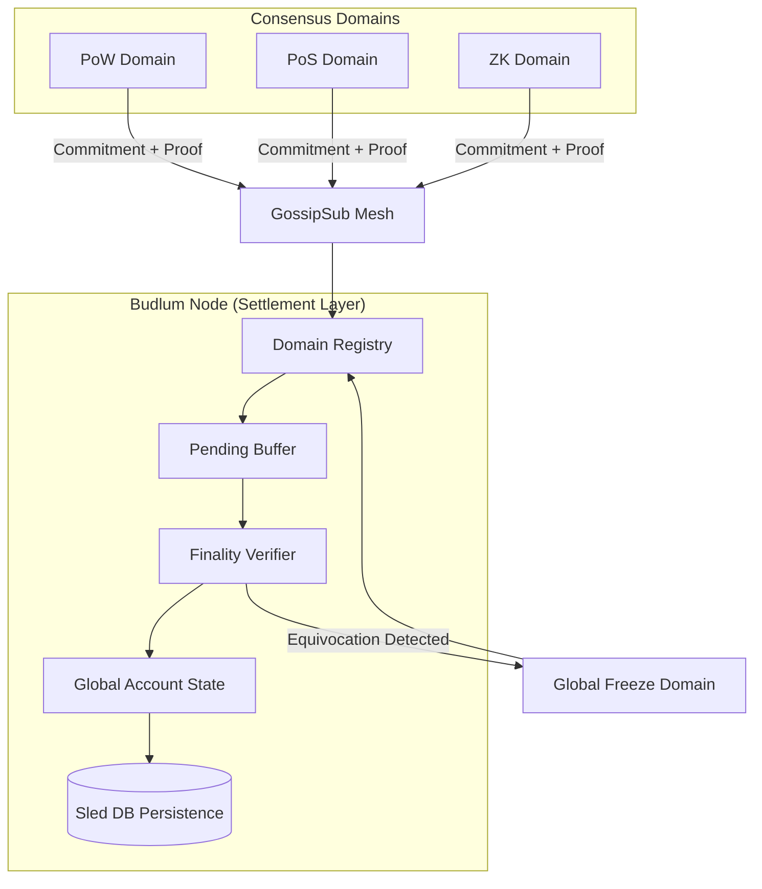

# Settlement Layer Test Matrix & Architecture

This document tracks the verification status of the Multi-Consensus Settlement Layer and provides an architectural overview.

## 1. Test Matrix

| Test Name | Property | Status |
|-----------|----------|--------|
| `test_cross_domain_double_spend_protection` | Shared-state safety | ✅ Passed |
| `test_parallel_cross_domain_stress_determinism` | Stress determinism | ✅ Passed |
| `test_async_gossip_random_delay_duplicate_drop` | Gossip convergence | ✅ Passed |
| `test_frozen_domain_persistence` | Byzantine state persistence | ✅ Passed |
| `test_adversarial_finality_proofs` | Finality proof validation | ✅ Passed |
| `test_restart_pending_buffer_persistence` | Crash recovery | ✅ Passed |
| `test_distributed_gossip_convergence` | Real-node convergence | ✅ Passed |

## 2. Architecture Diagram

## 3. Current Risks & Limitations

### Risks
- **Early-Stage Adapters:** Finality proof adapters (PoS/BFT) are currently using high-level signature threshold logic rather than full cryptographic BLS/Ed25519 verification.
- **Networking Scale:** While tested with 5 nodes in a controlled harness, the behavior under 100+ nodes with high latency is not yet benchmarked.
- **Economic Safety:** The lack of a finalized economic slashing model means there is currently no financial deterrent for Byzantine behavior, only protocol-level isolation.

### Limitations
- **Not Production-Ready:** Codebase requires professional security audits.
- **Formal Verification:** No TLA+ or formal proofs for the consensus convergence.
- **Public Testnet:** Currently limited to local devnet simulation harnesses.
- **Validator Economics:** Reward distribution and validator selection for the global layer are not yet implemented.

## 4. Budlum Core v0.1 — Multi-Consensus Settlement Prototype
The current state of the repository represents the **v0.1-settlement-prototype**. 

**Key Achievements:**
- [x] Deterministic global state for heterogeneous domains.
- [x] Byzantine equivocation immunity (Model B).
- [x] Persistent out-of-order execution buffering.
- [x] Distributed node convergence verified.
