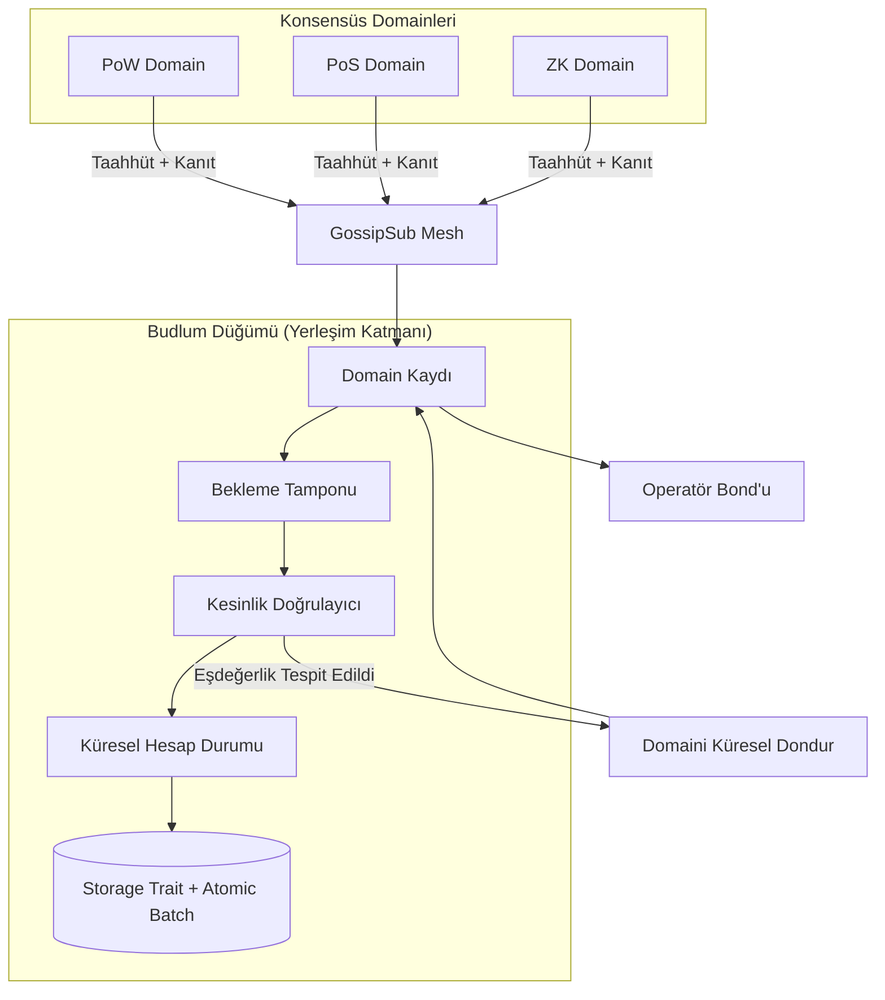

# Yerleşim Katmanı Test Matrisi ve Mimari

Bu döküman, Çoklu Konsensüs Yerleşim Katmanı'nın doğrulama durumunu takip eder ve mimari bir genel bakış sunar.

## 1. Test Matrisi

| Test Adı | Özellik | Durum |
|-----------|----------|--------|
| `test_cross_domain_double_spend_protection` | Paylaşımlı durum güvenliği | ✅ Geçti |
| `test_parallel_cross_domain_stress_determinism` | Stres determinizmi | ✅ Geçti |
| `test_async_gossip_random_delay_duplicate_drop` | Gossip yakınsaması | ✅ Geçti |
| `test_frozen_domain_persistence` | Bizans durum kalıcılığı | ✅ Geçti |
| `test_adversarial_finality_proofs` | Kesinlik kanıtı doğrulaması | ✅ Geçti |
| `test_restart_pending_buffer_persistence` | Çökme sonrası kurtarma | ✅ Geçti |
| `test_distributed_gossip_convergence` | Gerçek düğüm yakınsaması | ✅ Geçti |

## 2. Mimari Diyagram

## 3. Mevcut Riskler ve Sınırlamalar

### Riskler
- **Erken Aşama Adapterlar:** Kesinlik kanıtı adapterları (PoS/BFT), tam kriptografik BLS/Ed25519 doğrulaması yerine şimdilik üst düzey imza eşiği mantığını kullanmaktadır.
- **Ağ Ölçeği:** Kontrollü bir harness içinde 5 düğümle test edilmiş olsa da, yüksek gecikmeli 100+ düğüm altındaki davranış henüz benchmark edilmemiştir.
- **Ekonomik Güvenlik:** Validator slashing ve ödüller devnet seviyesindeki PoS akışları için uygulanmıştır; domain registration artık operatör kimliği ve bond gerektirir. Mainnet seviyesinde yönetişim, bond boyutlandırması ve audit incelemesi hâlâ gereklidir.

### Sınırlamalar
- **Kontrollü Public Devnet'e Hazır:** Mevcut kod açık deneysel uyarılarla public devnet çalıştırabilir.
- **Mainnet'e Hazır Değil:** Kod tabanı mainnet öncesi profesyonel güvenlik denetimleri, operasyonel sertleştirme, fuzzing ve API/error cleanup gerektirir.
- **Resmi Doğrulama:** Konsensüs yakınsaması için TLA+ veya resmi kanıtlar bulunmamaktadır.
- **Public Testnet Kapsamı:** Public devnet uygundur; audited production/mainnet deployment uygun değildir.
- **Structured Errors:** `BudlumError` vardır ve kritik execution path'leri bunu kullanır; fakat birkaç API'de `Result<T, String>` uyumluluğu korunmaktadır.

## 4. Budlum Core v0.1 — Kontrollü Public Devnet Adayı
Deponun mevcut durumu **kontrollü public devnet adayıdır**; audited mainnet implementasyonu değildir.

**Temel Başarılar:**
- [x] Heterojen domainler için deterministik küresel durum.
- [x] Bizans eşdeğerlik bağışıklığı (Model B).
- [x] Taahhüt + domain yükseklik/hash güncellemeleri için atomik settlement kalıcılığı.
- [x] Dağıtık düğüm yakınsaması doğrulandı.
- [x] Slashing evidence gossip ve blok dahil etme akışı.
- [x] Devnet seviyesinde PoS slashing/reward execution.
